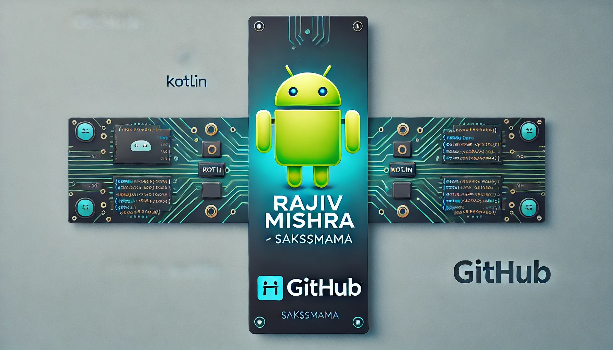

<h1 align="center">Hi 👋, I'm Rajiv Mishra</h1>
<h3 align="center">Future Android Developer 🚀 | Kotlin Learner | Passionate about Tech 💪</h3>

  

- 🔭 Currently working on **Sakssmama - English Learning App**

- 🌱 Learning **Android Development + DSA**

- 💬 Ask me about **Kotlin , Android Studio**

- 📫 How to reach me: mishrarajiv14144303@gmail.com

<h3 align="left">Connect with me:</h3>

---

### 📊 GitHub Stats
readme-stats.vercel.app/api?username=Sakssmama01&show_icons=true&theme=tokyonight&count_private=true&hide=prs)

---

### 🔥 Languages & Tools  
  
  
  
  
